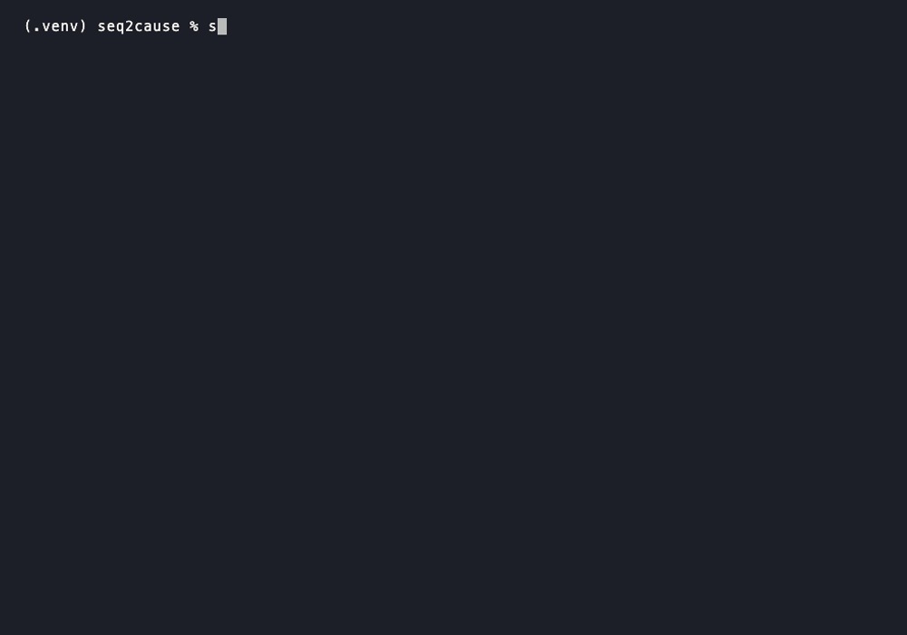

# seq2cause

Turn any sequence of discrete events into a causal graph using autoregressive models (LLaMA, GPT, RNN, Mamba).

[](https://doi.org/10.5281/zenodo.19068730)
[](https://pypi.org/project/seq2cause/)
[](https://opensource.org/licenses/MIT)
[](https://www.python.org/downloads/)

**seq2cause** is a Python library for causal discovery on discrete event sequences. It treats any autoregressive model as a density estimator and runs parallelized conditional-independence tests on GPU, so you can recover what caused what directly from a sequence of logs, codes, or symbols.



## 🚀 Key Features

- **Bring your own model**: plug in any HuggingFace/PyTorch model (GPT-2, LLaMA, RNN) trained on your own event sequences.
- **Scales to long sequences**: memory grows linearly with vocabulary and sequence length, well suited to sparse, high-dimensional streams like vehicle diagnostics, server logs, or user journeys.
- **Multi-GPU ready**: powered by 🤗 Accelerate, tested on CPU, Apple Silicon (MPS), and NVIDIA CUDA, single or multi-device.
- **Delayed effects**: causal lags are identifiable up to the sequence length.
- **Event-to-event and event-to-outcome graphs** from a single sequence. Aggregating these into a global causal graph across many sequences is on the roadmap.

## 📦 Installation

```bash
pip install seq2cause
```

## ⚡ Quick Start

Recover a causal graph from your own sequence of events, using your own model. No known generator and no labeled ground truth needed. `HFModelAdapter` wraps any HuggingFace causal LM (a fine-tuned checkpoint, `LlamaForCausalLM.from_pretrained(...)`, etc.); here we use a small, randomly initialized model just so the snippet runs standalone. This exact example is part of the test suite (`tests/test_readme_example.py`).

```python
import torch
from transformers import LlamaConfig, LlamaForCausalLM
from seq2cause.adapters import HFModelAdapter
from seq2cause.diagnostics import compute_cmi_matrix
from seq2cause.threshold import AdaptiveThreshold

# 1. Your model (any HF causal LM) and your own event sequence (token ids).
vocab_size = 20
model = LlamaForCausalLM(LlamaConfig(
    vocab_size=vocab_size, hidden_size=32, intermediate_size=64,
    num_hidden_layers=2, num_attention_heads=2, max_position_embeddings=32,
)).eval()
adapter = HFModelAdapter(model, vocab_size=vocab_size)
sequence = torch.randint(0, vocab_size, (20,))  # your real event sequence

# 2. Conditional Mutual Information between every (cause, effect) pair.
cmi_matrix = compute_cmi_matrix(adapter, sequence, context_len=3, n_particles=32)

# 3. Turn CMI scores into a binary causal graph, no labels needed.
causal_graph = AdaptiveThreshold().causal_graph(cmi_matrix)
```

### Command-line interface

The same three steps are available as a `seq2cause` command, so you can run causal discovery over your own tokenized dataset without writing any Python:

```bash
seq2cause --dataset events.txt --model gpt2
```

`--dataset` accepts a plain text file (one sequence per line, whitespace/comma-separated token ids), or a `.pt`/`.npy` file (a tensor, or a list of variable-length sequences). `--model` is any HuggingFace causal LM id or local checkpoint path; its vocabulary size is read from the model automatically. Omit `--model` to fall back to a small randomly initialized model for quick experimentation, in which case the vocabulary size is inferred from the dataset's own token ids (or set explicitly with `--vocab-size`). See `seq2cause --help` for the full set of options (`--context-len`, `--n-particles`, `--strategy`, `--output`, `--device`, ...).

## 🧪 Evaluation (against a known generator)

To validate the method itself, `seq2cause.scm.NonlinearSCM` is a synthetic generator with a known ground-truth causal graph. This lets you measure recall and F1 directly, and pick a threshold by maximizing F1 on a held-out validation split.

```python
import torch
from seq2cause.scm import create_scm
from seq2cause.diagnostics import ground_truth_adjacency, compare_intervention_strategies
from seq2cause.threshold import select_threshold_by_validation

torch.manual_seed(0)

# 1. A sequence from a known generator, so we can check our own answers.
scm, sequences = create_scm(vocab_size=15, memory=3, length=20, seed=0, sparsity=0.5)
sequence = sequences[0]

# 2. Ground-truth edges, only possible because the generator is known.
adjacency = ground_truth_adjacency(scm, sequence, threshold=0.05, n_counterfactuals=16)

# 3. Same recovery step as Quick Start.
results = compare_intervention_strategies(
    scm, sequence, context_len=3, adjacency=adjacency, n_particles=32, max_lag=3,
)
cmi_matrix = results["atomic"].cmi_matrix

# 4. With labels available, pick tau by maximizing F1 instead of guessing.
scores, labels = cmi_matrix.flatten(), adjacency[3:, 3:].flatten()
result = select_threshold_by_validation(scores, labels, delta=0.05)
causal_graph = cmi_matrix >= result.tau
print(result.summary())  # e.g. F1=0.800, precision=0.800, recall=0.800
```

## 📚 How It Works

seq2cause treats an autoregressive model's own next-token predictions as a density estimator. For each candidate (cause, effect) pair, it compares the model's predicted probability of the effect with and without the cause intervened on (`seq2cause.sampling.do_interventions`), and reports the Conditional Mutual Information between them (`seq2cause.diagnostics`).

## Graph Types

- **Event-to-event** (implemented here): the TRACE algorithm, using CMI to recover a causal graph from a single sequence.
- **Event-to-outcome and global aggregation**: the OSCAR/CARGO algorithms from the paper aren't implemented in this repo yet.

Also on the roadmap: causal discovery for time series, using normalizing flows or AR models.

## 🖥️ GPU / Multi-GPU Acceleration

`seq2cause.core.SampleLevelCausalDiscovery` wraps your model and dataloader with [🤗 Accelerate](https://github.com/huggingface/accelerate), so the same code runs unchanged on CPU, one GPU, or many (`accelerate launch --multi_gpu`). Tested on CPU, Apple Silicon (MPS), and NVIDIA CUDA.

A `tqdm` progress bar shows batch/context progress along with a rough estimate of the VRAM or RAM the current step needs (a lower bound, see `seq2cause.utils.estimate_tensor_bytes`), so you get an early signal before a run runs out of memory.

To test multi-GPU correctness without real GPU hardware, `accelerate launch --num_processes=2 --cpu your_script.py` runs two real processes over the `gloo` backend, exercising the same sharding and `gather()` code paths a real multi-GPU launch uses. `tests/test_multi_gpu.py` does exactly this: it checks that each process gets a disjoint shard of the data, that `gather()` reassembles it correctly, and that every process produces a valid adjacency matrix.

### Avoiding an out-of-memory crash

Before running a batch, `SampleLevelCausalDiscovery` compares its estimated tensor size against the memory currently available on the device and raises a clear `MemoryError` if it would use more than 80% of it, instead of letting the run crash deep inside a forward pass. Call `seq2cause.utils.check_memory_budget` directly if you want the same check in your own code:

```python
from seq2cause.utils import check_memory_budget, estimate_tensor_bytes

est_bytes = estimate_tensor_bytes(batch_size, n_particles, context_len, seq_len, vocab_size)
check_memory_budget(est_bytes, device="cuda")  # raises MemoryError if too tight
```

This works reliably on CUDA (`torch.cuda.mem_get_info`) and on CPU if `psutil` is installed. Apple Silicon's MPS backend has no public "free memory" query as of this writing, so the check silently does nothing there; an MPS run can still run out of memory without a warning.

## 🎯 Threshold Selection

**No labeled ground truth** (the realistic case, see Quick Start above): `AdaptiveThreshold` is the recommended default. It fits Otsu once, globally, anchored at lag 1, then decays it exponentially toward an Otsu-fit floor as lag increases. Fitting Otsu independently per lag instead starves deeper lags of samples and costs 15 to 18 F1 points.

```python
from seq2cause.threshold import AdaptiveThreshold

causal_graph = AdaptiveThreshold().causal_graph(cmi_matrix)
```

Other unsupervised options (`mad_threshold`, `percentile_threshold`, `gmm_threshold`) are available in `seq2cause.threshold` but were weaker in our own testing.

**Labeled ground truth available** (Evaluation above, or benchmarking): a fixed CMI threshold doesn't transfer across generators or backbones. Following an independent replication (Chadyuk, Zhang, and Kucukates, "Replicating TRACE: A Practitioner's Guide to Its Threshold and Particle Budget", LotusFlare Inc., Aug 2026), the recommended practice is to select the threshold by maximizing F1 on a held-out validation split instead of hardcoding a constant.

```python
from seq2cause.threshold import select_threshold_by_validation

result = select_threshold_by_validation(
    cmi_scores,  # per-pair CMI on a held-out validation split
    labels,      # aligned boolean ground-truth edge labels
    delta=0.05,  # the KL margin used to define a ground-truth edge, if known
)
print(result.summary())
tau = result.tau
```

## Alternative Intervention Constructions

An independent replication found that the paper's original "full" staircase construction (`seq2cause.sampling.do_interventions`) tends to collapse when the true causal strength decays with lag. `do_interventions` supports a few strategies to work around this. `"atomic"` is the recommended default, though `do_interventions` itself still defaults to `"full"` for backward compatibility with the paper's original results.

- **`atomic`** (recommended): only the candidate-cause position is randomized, everything else stays real.
- **`full`** (default): the original staircase construction.
- **`windowed`**: preserves a trailing local-context window before each candidate effect.
- **`independent_mediator`**: draws the cause and mediator noise independently instead of from a shared tensor.

Run `python scripts/snr_diagnostic.py` for a self-contained comparison of all four on a synthetic oracle SCM.

## Sparse / Bounded-Memory Construction

If you know, or are willing to assume, an upper bound on the true causal lag (for example a `NonlinearSCM(memory=m)` generator), `compute_cmi_matrix_sparse` recovers the same causal graph as the unbounded computation for a fraction of the compute on long sequences. It slides a short local window across the sequence instead of processing it all at once.

```python
from seq2cause.diagnostics import compute_cmi_matrix_sparse

cmi_matrix = compute_cmi_matrix_sparse(
    adapter, sequence, context_len=5, memory=3, n_particles=32,
)  # context_len must be greater than memory
```

This is exact, not an approximation, whenever `memory` truly bounds the lag. `scripts/evaluate_sparse_vs_full.py` confirms this empirically: pooled F1 is typically within 0.01 to 0.02 of the unbounded computation, with a 2x to 5x speedup that grows with sequence length.

```bash
python scripts/evaluate_sparse_vs_full.py --seq-len 400 --memory 3 --context 4
```

## Citation
If you use seq2cause in your research, please cite our works:

```bibtex
@software{math2026seq2cause,
  author = {Math, Hugo},
  title = {seq2cause: Sample- and Population-Level Causal Discovery from Event Sequences using Autoregressive Models},
  year = {2026},
  publisher = {Zenodo},
  doi = {10.5281/zenodo.19068730},
  url = {https://doi.org/10.5281/zenodo.19068730},
  version = {0.1.7}
}
```

```bibtex
@inproceedings{
math2026your,
title={Your Autoregressive Model Already Reveals the Causal Graph},
author={Hugo Math and Rainer Lienhart},
booktitle={ICML 2026 Workshop on Structured Probabilistic Inference {\&} Generative Modeling},
year={2026},
url={https://openreview.net/forum?id=Q66hINx9fA}
}
```

```bibtex
@inproceedings{
math2025oneshot,
title={One-Shot Multi-Label Causal Discovery in High-Dimensional Event Sequences},
author={Hugo Math and Robin Sch{\"o}n and Rainer Lienhart},
booktitle={NeurIPS 2025 Workshop on CauScien: Uncovering Causality in Science},
year={2025},
url={https://openreview.net/forum?id=z7NT8vGWC2}
}
```

```bibtex
@inproceedings{
math2025towards,
title={Towards Practical Multi-label Causal Discovery in High-Dimensional Event Sequences via One-Shot Graph Aggregation},
author={Hugo Math and Rainer Lienhart},
booktitle={NeurIPS 2025 Workshop on Structured Probabilistic Inference {\&} Generative Modeling},
year={2025},
url={https://openreview.net/forum?id=1HZfpuDVeW}
}
```

## License
This project is licensed under the MIT License, see the LICENSE file for details.

## Building
Ruff keeps the code clean; pre-commit runs it automatically before every commit.

```bash
pre-commit run --all-files
git add .
git commit -m "your message"
git push origin main
```
